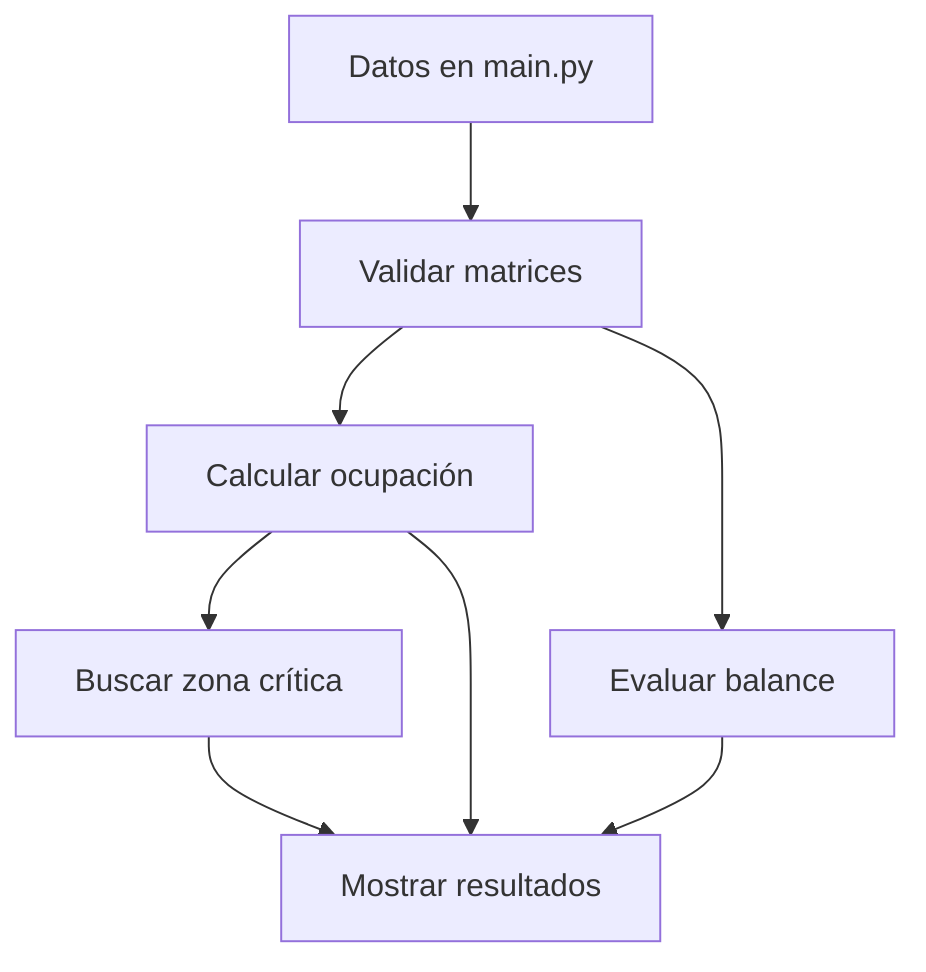

# AeroCargo-Matrix

Programa desarrollado en Python para revisar la distribución de carga en la bodega de una aeronave mediante el uso de matrices y funciones.

## Descripción del problema

En una aeronave es importante distribuir correctamente la carga para evitar que una zona del piso supere su capacidad máxima y para mantener un balance entre el lado izquierdo y el derecho.

Para representar la bodega se utilizan dos matrices:

- Una matriz con los pesos colocados.
- Una matriz con las capacidades máximas.

El programa calcula el porcentaje de ocupación de cada posición, identifica las zonas sobrecargadas, calcula el peso de cada fila y revisa el balance lateral.

También permite encontrar una zona crítica utilizando una submatriz de tamaño definido.

## Funciones del programa

El programa se divide en cuatro funciones principales:

- `validar_matrices()`: comprueba que las matrices tengan las dimensiones y valores correctos.
- `calcular_ocupacion()`: calcula los porcentajes y encuentra las posiciones sobrecargadas.
- `evaluar_balance()`: calcula el peso por fila y compara el lado izquierdo con el derecho.
- `extraer_submatriz_critica()`: busca la zona con mayor promedio de ocupación.

## Arquitectura



El archivo `main.py` contiene los datos de prueba y muestra los resultados.

El archivo `aerocargo.py` contiene las funciones utilizadas para realizar los cálculos.

El archivo `test_aerocargo.py` contiene las pruebas para comprobar el funcionamiento.

## Complejidad

Para validar las matrices, calcular la ocupación y evaluar el balance se deben recorrer sus filas y columnas.

Si la matriz tiene `N` filas y `M` columnas, el tiempo utilizado es:

`O(N x M)`

La matriz de porcentajes tiene las mismas dimensiones, por lo que la memoria utilizada también es:

`O(N x M)`

La búsqueda de la submatriz requiere recorridos adicionales dependiendo del tamaño de la ventana seleccionada.

## Ejecución

Para ejecutar el programa:

```bash
py main.py
```

Para ejecutar las pruebas:

```bash
py -m unittest -v
```

## Autor

Emma Zelada