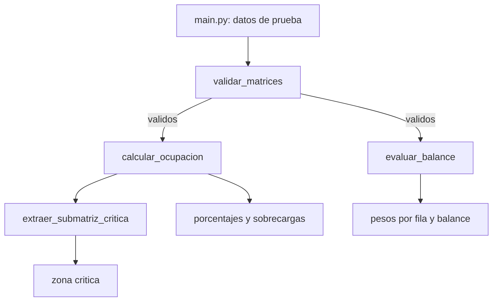

# AeroCargo-Matrix

Solucion modular en Python para auditar la distribucion de carga en la bahia de una aeronave.

## Objetivo

El piso de carga se representa mediante dos matrices `N x M`: una contiene los pesos reales y otra las capacidades maximas por compartimiento. El programa valida los datos, calcula la ocupacion porcentual, identifica sobrecargas locales, analiza la distribucion longitudinal, verifica la simetria lateral y extrae la region contigua con mayor promedio de ocupacion.

## Importancia aeronautica

La capacidad limite de cada zona del piso debe respetarse para evitar concentraciones de carga que puedan comprometer la estructura. Ademas, una diferencia excesiva entre babor y estribor produce una distribucion lateral asimetrica. Este programa funciona como una auditoria inicial de una distribucion propuesta; no reemplaza los procedimientos certificados de peso y balance ni calcula el centro de gravedad de una aeronave real.

## Arquitectura modular



Las funciones de `aerocargo.py` reciben todos sus datos como parametros, no utilizan variables globales y no modifican las matrices originales.

## Contratos de las funciones

- `validar_matrices(cargas, capacidades) -> bool`: comprueba matrices regulares del mismo tamano, minimo `2 x 2`, pesos no negativos y capacidades positivas.
- `calcular_ocupacion(cargas, capacidades) -> (matriz, lista)`: crea la matriz porcentual y devuelve coordenadas `(fila, columna)` cuyo porcentaje es mayor que 100.
- `evaluar_balance(cargas, tolerancia) -> (lista, numero, bool)`: devuelve peso total por fila, desbalance lateral absoluto y aprobacion. Si hay columnas impares, omite la central.
- `extraer_submatriz_critica(porcentajes, k, p) -> matriz`: devuelve la ventana contigua `k x p` con mayor promedio. En un empate conserva la primera encontrada.

## Complejidad computacional

Para una matriz de `N x M`, validacion, ocupacion y balance recorren cada celda una vez: tiempo `O(N x M)`. La nueva matriz de porcentajes utiliza memoria `O(N x M)`; los demas resultados ocupan como maximo ese mismo orden.

La busqueda directa evalua `(N-k+1)(M-p+1)` ventanas y recorre `k x p` valores por ventana, por lo que su cota general es `O((N-k+1)(M-p+1)kp)`. Si `k` y `p` son constantes pequenas, su comportamiento respecto de `N` y `M` se simplifica a `O(N x M)`. Esta precision evita afirmar incorrectamente que cualquier tamano variable de ventana siempre cuesta solo `O(N x M)`.

## Requisitos y ejecucion

Solo requiere Python 3; no utiliza paquetes externos.

```bash
python main.py
```

Para ejecutar las pruebas:

```bash
python -m unittest -v
```

## Casos limite contemplados

- Matriz minima `2 x 2` y pesos iguales a cero.
- Matrices irregulares o de dimensiones distintas.
- Pesos negativos y capacidades menores o iguales a cero.
- Columnas pares e impares.
- Porcentaje exactamente igual a 100, que no cuenta como sobrecarga.
- Ventana igual a toda la matriz o mayor que ella.
- Tolerancia cero o positiva; las tolerancias negativas se rechazan.

## Estructura

```text
das172-examen2-zelada-emma/
|-- aerocargo.py
|-- main.py
|-- test_aerocargo.py
|-- README.md
`-- .gitignore
```

## Autor

Emma Zelada
